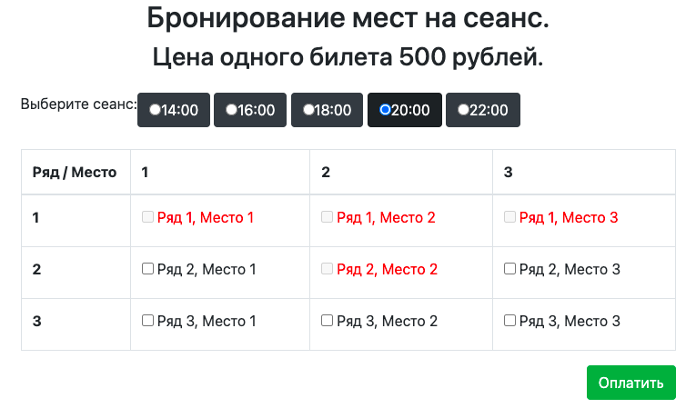
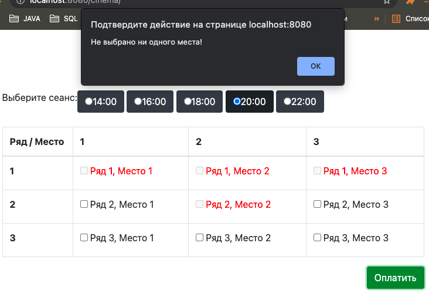
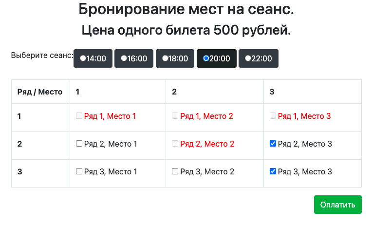
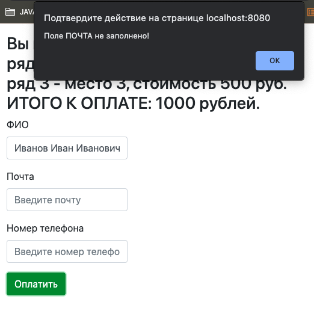

# Cinema

## О проекте.
Cinema - приложение для заказа билетов на сеанс в кинотеатр.
Пользователь может выбрать сеанс и любое количество свободных 
мест на данный сеанс, ввести свои данные и оплатить покупку.

Использованы технологии:

- Java EE Servlet API
- Apache Tomcat
- JDBC
- PostgreSQL
- JS (jQuery, AJAX) 
- JSP, HTML, CSS
- Log4j
- Maven
- Travis CI

## Сборка и установка.
Сборка проекта с помощью Maven в WAR-архив для последующего 
развертывания в контейнере сервлетов (Apache Tomcat и т.п.).

`mvn inslall`

Скрипты для базы данных: db/schema.sql

## Контакты.
Если у вас есть какие-либо вопросы, не стесняйтесь обращаться ко мне:

Евгений Зайцев

[cyberfuzzapps@gmail.com](mailto:cyberfuzzapps@gmail.com)
